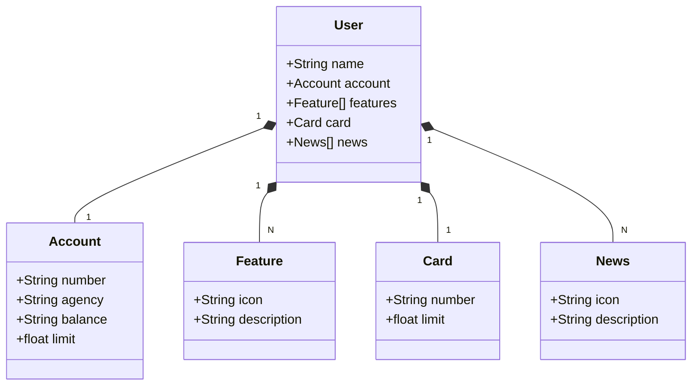

# API RESTful para um App de um Banco
APi RESTful na Nuvem Usando Spring Boot 3, Java 17, Gradle, JPA e Railway.

## Principais Tecnologias
- Java 17: Utilizaremos a versão LTS mais recente do Java para tirar vantagem das últimas inovações que essa linguagem robusta e amplamente utilizada oferece;
- Gradle: E uma ótima ferramenta de automação de compilação de código aberto para Java e outros projetos baseados em JVM;
- Spring Boot 3: Trabalharemos com a mais nova versão do Spring Boot, que maximiza a produtividade do desenvolvedor por meio de sua poderosa premissa de autoconfiguração;
- Spring Data JPA: Exploraremos como essa ferramenta pode simplificar nossa camada de acesso aos dados, facilitando a integração com bancos de dados SQL;
- OpenAPI (Swagger): Vamos criar uma documentação de API eficaz e fácil de entender usando a OpenAPI (Swagger), perfeitamente alinhada com a alta produtividade que o Spring Boot oferece;
- Railway: facilita o deploy e monitoramento de nossas soluções na nuvem, além de oferecer diversos bancos de dados como serviço e pipelines de CI/CD.

## Diagrama de classes

## Endpoints e URLs de acesso

- H2 (acessar via browser)
http://localhost:8080/h2-console

- Acessar o Swagger
http://localhost:8080/swagger-ui.html

## Pré-requisitos
- Java 17
- Git

## Contato

